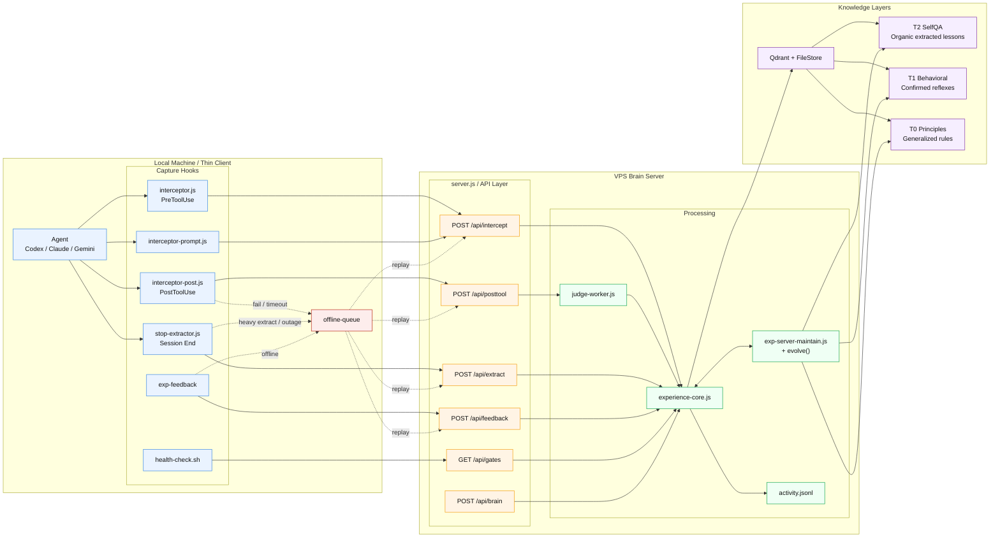

<p align="center">
  <h1 align="center">Experience Engine</h1>
  <p align="center">
    <strong>AI agents that learn from mistakes — not just store facts.</strong>
  </p>
  <p align="center">
    <a href="#quick-start">Quick Start</a> ·
    <a href="#how-it-works">How It Works</a> ·
    <a href="#comparison">Comparison</a> ·
    <a href="#rest-api">REST API</a> ·
    <a href="#python-sdk">Python SDK</a>
  </p>
  <p align="center">
    
    
    
    
    
    
  </p>
</p>

---

<p align="center">
  
</p>

Memory stores what you know. **Experience changes how you act.**

```
Without Experience Engine:
  Session 1: DbContext singleton → bug → 15 min debug
  Session 2: DbContext singleton → same bug → 15 min debug (again)
  Session 50: 200 notes. Still making the same mistakes. Still a junior.

With Experience Engine:
  Session 1: DbContext singleton → bug → lesson extracted automatically
  Session 2: About to repeat → hook fires → "⚠️ Last time this caused state corruption"
  Session 15: 3 similar lessons → evolved into principle:
              "Stateful objects must be scoped, never singleton"
  Session 16: RedisConnection singleton (NEVER SEEN) → principle matches → avoided
              Memory: 50 entries → 15 principles. Fewer entries. More coverage.
```

**The only AI memory system where capability grows while memory shrinks.**

## Why Not Just Memory?

Every AI memory tool (Mem0, Letta, Zep) stores facts. More sessions = more entries = more tokens = more cost. They're giving your agent a bigger notebook — but a notebook doesn't make you experienced.

Experience Engine is different:

| | Memory tools | Experience Engine |
|---|---|---|
| **Storage** | Facts accumulate forever | Lessons evolve into principles, entries get deleted |
| **Over time** | 500 entries = 500 entries | 500 entries → 15 principles (then entries deleted) |
| **Novel cases** | Only matches exact cases seen before | Principles match cases **never seen before** |
| **Token cost** | Grows linearly | **Shrinks** as principles replace specific entries |
| **Agent level** | Junior with a big notebook | Mid-level who understands **why** |

## Quick Start

### Option A: Docker (recommended — one command)

Prerequisites: Docker + Docker Compose. Nothing else.

```bash
git clone https://github.com/muonroi/experience-engine.git
cd experience-engine
docker compose up -d
```

This starts everything:
- **Qdrant** vector database (port 6333)
- **Ollama** with embedding + brain models auto-pulled (port 11434)
- **Experience Engine API** (port 8082)

```bash
# Verify
curl http://localhost:8082/health
# {"status":"ok","qdrant":{"status":"ok"},"fileStore":{"status":"ok"}}

# Stop
docker compose down

# Logs
docker compose logs -f experience-engine
```

100% local. Zero API keys. Zero config files. Just Docker.

### Option B: Manual setup (more control)

```bash
git clone https://github.com/muonroi/experience-engine.git
cd experience-engine
bash .experience/setup.sh
```

Interactive wizard guides you through vector store + AI provider setup:

```
Step A — Vector store:    Qdrant Cloud (free) / Local Docker / VPS SSH tunnel
Step B — Embed provider:  OpenAI / Gemini / SiliconFlow / VoyageAI / Ollama / Custom
Step C — Brain provider:  OpenAI / Gemini / Claude / DeepSeek / SiliconFlow / Ollama / Custom
Step D — Agent wiring:    Claude Code / Gemini CLI / Codex CLI / OpenCode
```

**Done.** Your agent starts learning from mistakes immediately.

### Option C: npm CLI package

If you want the installer/runtime without cloning the repo first, use the npm package.

```bash
npx @muonroi/experience-engine setup
```

Or install it globally:

```bash
npm install -g @muonroi/experience-engine
experience-engine setup
```

The npm package is intentionally a CLI/runtime wrapper around the existing installer and
`server.js`. It is not presented as a stable Node library API yet.

Useful commands:

```bash
experience-engine setup
experience-engine setup-thin-client --server http://your-vps:8082 --token YOUR_TOKEN --clean
experience-engine sync-install
experience-engine server
experience-engine health
```

Current recommended npm-based setup flows:

```bash
# Local/full install on the current machine
npx @muonroi/experience-engine setup

# Thin client on a laptop/WSL box that should use an existing VPS brain
npx @muonroi/experience-engine setup-thin-client \
  --server http://your-vps:8082 \
  --token YOUR_SERVER_AUTH_TOKEN \
  --clean
```

If this machine will run the canonical VPS brain long-term, global install is usually more practical:

```bash
npm install -g @muonroi/experience-engine
experience-engine setup
experience-engine server
```

Use the repo clone flow when you want local source code, Docker assets, tests, or direct repo maintenance.

Maintainer release flow:

```bash
# bump package.json version
git commit -am "Release npm package v0.1.1"
git push origin develop
git tag v0.1.1
git push origin v0.1.1
```

Pushing a `v*` tag triggers the bundled GitHub Actions workflow, which runs `npm test`,
performs `npm pack --dry-run`, and publishes to npm using the repository `NPM_TOKEN` secret.

### Shortcuts

```bash
bash .experience/setup.sh --local   # Docker Qdrant + Ollama (100% free, 100% local)
bash .experience/setup.sh --vps     # VPS Qdrant via SSH tunnel
bash .experience/setup.sh --remote  # Connect to a remote VPS-hosted experience engine instead of local
                                    # Set EXP_SERVER_BASE_URL / EXP_SERVER_AUTH_TOKEN for thin-client mode
```

### Thin Client Mode

When `serverBaseUrl` is configured, the local machine becomes a thin hook client instead of the
canonical brain.

- Keep local: `config.json`, `tmp/last-suggestions.json`, offline queue, debug log, stop/evolve markers
- Move to VPS: intercept activity, post-tool reconciliation, judge queue, extract, evolve, stats, gates, Qdrant-backed brain state
- Result: switching machines only needs the same VPS URL/token; the brain stays on the server

```json
{
  "serverBaseUrl": "http://your-vps:8082",
  "serverAuthToken": "optional-bearer-token",
  "serverReadAuthToken": "optional-read-only-token-for-stats-and-gates",
  "serverTimeoutMs": 5000
}
```

Queued remote events live under `~/.experience/offline-queue/` and replay automatically on the
next hook invocation. Lightweight hook traffic is replayed inline; heavier queued `/api/extract`
events are compacted and drained in the background so PreToolUse/PostToolUse stay fast without
letting extract payloads grow unbounded.

Thin-client startup behavior:
- `setup-thin-client.sh` installs `exp-shell-init.sh` into both `~/.bashrc` and `~/.zshrc`
- opening a new shell automatically triggers a lightweight background bootstrap
- `exp-health-last` shows the latest persisted snapshot without rerunning the full dashboard
- if the machine was offline, queued events replay automatically once the VPS is reachable again

## Role-Based Setup

### Admin: Setup VPS Brain

Use this flow once per VPS. This machine holds the canonical brain, Qdrant-backed state, gates,
extract/evolve jobs, and server-side activity.

You can set up the VPS brain in two supported ways.

Option 1: repo clone (best when you also want local source, Docker files, tests, or easy `git pull`)

```bash
git clone https://github.com/muonroi/experience-engine.git
cd experience-engine
```

Then run the main setup with VPS-local Qdrant and provider credentials:

```bash
EXP_QDRANT_URL="http://localhost:6333" \
EXP_QDRANT_KEY="YOUR_QDRANT_KEY" \
EXP_EMBED_PROVIDER="siliconflow" \
EXP_BRAIN_PROVIDER="siliconflow" \
EXP_EMBED_MODEL="Qwen/Qwen3-Embedding-0.6B" \
EXP_BRAIN_MODEL="Qwen/Qwen2.5-7B-Instruct" \
EXP_EMBED_ENDPOINT="https://api.siliconflow.com/v1/embeddings" \
EXP_EMBED_KEY="YOUR_EMBED_KEY" \
EXP_BRAIN_ENDPOINT="https://api.siliconflow.com/v1/chat/completions" \
EXP_BRAIN_KEY="YOUR_BRAIN_KEY" \
EXP_SERVER_PORT="8082" \
EXP_SERVER_AUTH_TOKEN="YOUR_SERVER_AUTH_TOKEN" \
EXP_SERVER_READ_AUTH_TOKEN="YOUR_OPTIONAL_READ_TOKEN" \
EXP_AGENTS="codex" \
bash .experience/setup.sh
```

Option 2: npm package (best when you only want the installed runtime on the VPS)

```bash
npm install -g @muonroi/experience-engine
```

Then run the same setup through the packaged CLI:

```bash
EXP_QDRANT_URL="http://localhost:6333" \
EXP_QDRANT_KEY="YOUR_QDRANT_KEY" \
EXP_EMBED_PROVIDER="siliconflow" \
EXP_BRAIN_PROVIDER="siliconflow" \
EXP_EMBED_MODEL="Qwen/Qwen3-Embedding-0.6B" \
EXP_BRAIN_MODEL="Qwen/Qwen2.5-7B-Instruct" \
EXP_EMBED_ENDPOINT="https://api.siliconflow.com/v1/embeddings" \
EXP_EMBED_KEY="YOUR_EMBED_KEY" \
EXP_BRAIN_ENDPOINT="https://api.siliconflow.com/v1/chat/completions" \
EXP_BRAIN_KEY="YOUR_BRAIN_KEY" \
EXP_SERVER_PORT="8082" \
EXP_SERVER_AUTH_TOKEN="YOUR_SERVER_AUTH_TOKEN" \
EXP_SERVER_READ_AUTH_TOKEN="YOUR_OPTIONAL_READ_TOKEN" \
EXP_AGENTS="codex" \
experience-engine setup
```

3. Run the API as a persistent service on the VPS.

Do not rely on `node server.js` or `experience-engine server` in a transient shell if you want
reboot-safe behavior. Use a user-level `systemd` service.

If you used the repo clone flow:

```bash
mkdir -p ~/.config/systemd/user

cat > ~/.config/systemd/user/experience-engine.service <<'EOF'
[Unit]
Description=Experience Engine API Server
After=network.target

[Service]
Type=simple
WorkingDirectory=%h/experience-engine
ExecStartPre=/bin/bash %h/experience-engine/.experience/sync-install.sh --quiet
ExecStart=%h/.nvm/versions/node/v22.22.2/bin/node server.js
Restart=always
RestartSec=5
Environment=NODE_ENV=production

[Install]
WantedBy=default.target
EOF

systemctl --user daemon-reload
systemctl --user enable --now experience-engine.service

# Important for reboot persistence on VPS:
sudo loginctl enable-linger "$USER"
```

If you used the npm global-install flow, first discover the absolute binary path:

```bash
command -v experience-engine
```

Then use that path in the service file, for example:

```ini
[Service]
Type=simple
ExecStartPre=/usr/local/bin/experience-engine sync-install --quiet
ExecStart=/usr/local/bin/experience-engine server
Restart=always
RestartSec=5
Environment=NODE_ENV=production
```

If `server.js` was already started manually, stop that manual process before starting the service,
otherwise the service can flap with `EADDRINUSE` on port `8082`.

4. Verify the VPS brain explicitly:

```bash
systemctl --user status experience-engine.service --no-pager
curl http://127.0.0.1:8082/health
curl -H "Authorization: Bearer ${EXP_SERVER_READ_AUTH_TOKEN:-$EXP_SERVER_AUTH_TOKEN}" http://127.0.0.1:8082/api/gates
bash ~/.experience/health-check.sh --json
```

Expected:
- `experience-engine.service` is `active (running)`
- `/health` returns `status=ok`
- `/api/gates` returns JSON
- health check reports all pass or clearly explains the remaining issue

5. Install scheduled maintenance on the VPS:

```bash
crontab -e
```

Add:

```cron
*/15 * * * * /path/to/node /home/YOUR_USER/.experience/exp-server-maintain.js --trigger cron >> /home/YOUR_USER/.experience/maintain.log 2>&1
```

6. Keep portable backups so the brain can move to a new VPS later:

```bash
node tools/exp-portable-backup.js --out /var/backups/experience-$(date +%F)
```

Admin notes:
- Only the VPS needs Qdrant credentials, embed keys, and brain keys.
- Developers should not need direct access to those secrets.
- Re-running setup on an existing VPS does not require retyping secrets if `~/.experience/config.json`
  already exists. Pull the repo, then keep the current config:

```bash
cd ~/experience-engine
git pull --ff-only
printf '1\n' | bash .experience/setup.sh
```

- If you later migrate to another VPS, restore with `tools/exp-portable-restore.js` and then point
  thin clients at the new server URL/token.
- If you installed via npm instead of `git clone`, rerun `experience-engine setup` on the VPS after
  upgrading the global package.

### Dev: Setup Existing Machine

If a workstation already runs an older local/hybrid Experience Engine install, convert it into a
true thin client:

Repo clone flow:

```bash
git pull
bash .experience/setup-thin-client.sh \
  --server http://your-vps:8082 \
  --token YOUR_SERVER_AUTH_TOKEN \
  --clean
```

npm package flow:

```bash
npx @muonroi/experience-engine setup-thin-client \
  --server http://your-vps:8082 \
  --token YOUR_SERVER_AUTH_TOKEN \
  --read-token YOUR_OPTIONAL_READ_TOKEN \
  --clean
```

`--clean` backs up old local state under `~/.experience/backup-thin-client/<timestamp>/` and removes
local `activity.jsonl`, `store/`, and old markers so the machine stops behaving like a local brain.

### Dev: Setup Fresh Machine

On a brand-new machine, either clone the repo or use the npm package. Both install only the
thin-client hooks and local queue/state.

Repo clone flow:

```bash
git clone https://github.com/muonroi/experience-engine.git
cd experience-engine
bash .experience/setup-thin-client.sh \
  --server http://your-vps:8082 \
  --token YOUR_SERVER_AUTH_TOKEN \
  --read-token YOUR_OPTIONAL_READ_TOKEN
```

npm package flow:

```bash
npx @muonroi/experience-engine setup-thin-client \
  --server http://your-vps:8082 \
  --token YOUR_SERVER_AUTH_TOKEN
```

Thin-client notes:
- Local machines do not need `EXP_QDRANT_URL`, `EXP_QDRANT_KEY`, SSH tunnels, or provider API keys.
- The local machine keeps only hooks, config, temporary state, and offline queue.
- The canonical brain stays on the VPS.
- `--clean` is recommended when converting an old local/hybrid install into a real thin client.
- After setup, opening a new `bash` or `zsh` shell automatically runs the thin-client bootstrap.
- If you add a second or third workstation later, repeat this same thin-client setup there.

### Verify Checklist

After setup, verify both sides explicitly.

VPS brain checks:

```bash
curl http://localhost:8082/health
curl -H "Authorization: Bearer ${EXP_SERVER_READ_AUTH_TOKEN:-$EXP_SERVER_AUTH_TOKEN}" http://localhost:8082/api/gates
bash ~/.experience/health-check.sh --json
```

Expected:
- `/health` returns `status=ok`
- `/api/gates` returns JSON
- health check reports all pass or clearly explains any unhealthy item

Local thin-client checks:

```bash
bash ~/.experience/health-check.sh --json
```

Expected:
- `mode` reports `Thin client -> VPS brain`
- `remote_server` and `remote_gates` are `ok`
- `offline_queue` is empty or drains after the next hook
- no local Qdrant or SSH tunnel is required in thin-client mode

### Common Scenarios

#### A. Add Another Thin Client Later

For every additional workstation, do not manually copy an old `~/.experience` directory. Clone the
repo and run the thin-client installer against the same VPS, or use the npm package directly.

```bash
git clone https://github.com/muonroi/experience-engine.git
cd experience-engine
bash .experience/setup-thin-client.sh \
  --server http://your-vps:8082 \
  --token YOUR_SERVER_AUTH_TOKEN
```

Or:

```bash
npx @muonroi/experience-engine setup-thin-client \
  --server http://your-vps:8082 \
  --token YOUR_SERVER_AUTH_TOKEN
```

If that machine previously acted as a local brain, use `--clean`:

```bash
bash .experience/setup-thin-client.sh \
  --server http://your-vps:8082 \
  --token YOUR_SERVER_AUTH_TOKEN \
  --clean
```

#### B. Build A New VPS And Attach Thin Clients From Scratch

1. Provision the VPS and install Node.js + Qdrant.
2. Either clone the repo on the VPS or install `@muonroi/experience-engine` globally.
3. Run `setup.sh` or `experience-engine setup` with provider keys, Qdrant URL, and `EXP_SERVER_AUTH_TOKEN`.
4. Install and enable `experience-engine.service`.
5. Verify `/health`, authenticated `/api/gates`, and `bash ~/.experience/health-check.sh --json`.
6. On every workstation, run `setup-thin-client.sh --server ... --token ...` or `experience-engine setup-thin-client --server ... --token ...`.

This gives you one canonical brain on the VPS and any number of thin clients on laptops, desktops,
or WSL shells.

#### C. Reboot Behavior

- VPS reboot:
  `experience-engine.service` should come back automatically.
- Thin-client machine reboot:
  nothing needs to be reinstalled; the next time you open a shell, `exp-shell-init.sh` bootstraps
  the client automatically.
- Quick post-reboot check:

```bash
exp-health-last
```

If you need the full dashboard:

```bash
bash ~/.experience/health-check.sh --json
```

## How It Works

```
YOU write code with any AI agent
  │
  ├─ BEFORE relevant mutating tools (Codex: Bash, other runtimes may include Edit/Write/Bash)
  │   └─ Layer 1: Read-only skip — ls, git log, cat etc. bypass instantly (0ms, $0)
  │   └─ Layer 2: Semantic search — "Have I seen this mistake before?"
  │   └─ Detects language from file being edited (.ts → TypeScript, .cs → C#)
  │   └─ Ranks results by quality: hit count, recency, confidence, domain match
  │   └─ Follows 1-hop graph edges to surface related experiences
  │   └─ Layer 3: Brain relevance filter — asks LLM "is this warning relevant HERE?"
  │   └─ If relevant → injects warning: "⚠️ Last time this caused X"
  │
  └─ AFTER every session
      └─ Extracts lessons from mistakes (retry loops, user corrections, test failures)
      └─ Stores Q&A in vector DB with domain tags
      └─ Evolution engine: promote confirmed → generalize clusters → prune stale
      └─ Memory shrinks as capability grows
```

## Runtime Architecture



## 4-Tier Architecture

```
T0 Principles  (~400 tokens)  — generalized rules, always loaded
T1 Behavioral  (~600 tokens)  — specific reflexes, always loaded
T2 QA Cache    (semantic)     — detailed Q&A, retrieved on match
T3 Raw         (staging)      — unprocessed, TTL 30 days

Lifecycle: T2 (3x confirmed) → promote T1 → generalize → T0
           T2 (3x ignored) → demote → archive
           Memory SHRINKS as capability GROWS
```

## Experience Graph

Experiences are linked with typed edges — not isolated entries:

```
DbContext singleton ──generalizes──→ "Stateful objects: always scoped"
                    ──relates-to───→ HttpClient singleton
                    ──supersedes───→ [old] "Use transient for DbContext"
```

**Edge types:**
- `generalizes` — principle created from cluster of specific lessons
- `contradicts` — demoted experience that conflicted with reality
- `supersedes` — newer knowledge replaces older (temporal chain)
- `relates-to` — high similarity but different domain

Retrieval follows 1-hop edges automatically — when one experience matches, related ones surface too.

## Temporal Reasoning

Knowledge evolves. Experience Engine tracks **when** things were confirmed, not just **what** was learned:

```
Jan: "Use singleton for HttpClient" (confirmed 5x)
Mar: "Actually, use IHttpClientFactory" (contradicts Jan entry)
     → Jan entry superseded, not deleted
     → New entry ranked higher (recent confirmation)
     → Timeline API shows the evolution
```

## Multi-User Support

Multiple users on the same machine get isolated stores:

```bash
EXP_USER=alice node server.js    # Alice's experiences
EXP_USER=bob node server.js      # Bob's experiences (completely isolated)
```

Share principles across users without sharing personal data:

```bash
# Alice shares a principle
curl -X POST localhost:8082/api/principles/share \
  -d '{"principleId": "abc-123"}'
# Returns portable JSON — no personal data

# Bob imports it
curl -X POST localhost:8082/api/principles/import \
  -d '{"principle": "...", "solution": "...", "confidence": 0.85}'
```

## REST API

Start the server:

```bash
node server.js
# Experience Engine API running on http://localhost:8082
```

**Endpoints:**

When `server.authToken` (or `serverAuthToken`) is configured, every `POST` endpoint and every
`GET /api/*` endpoint requires `Authorization: Bearer <token>`. If `server.readAuthToken`
(or `serverReadAuthToken`) is configured, read-only observability endpoints (`/api/stats`,
`/api/gates`) also accept that token. `/health` remains public for liveness checks and local
service supervision.

| Method | Path | Description |
|--------|------|-------------|
| `GET` | `/health` | Qdrant + FileStore status |
| `POST` | `/api/intercept` | Query experience before tool call |
| `POST` | `/api/posttool` | Canonical post-tool reconciliation + judge enqueue |
| `POST` | `/api/extract` | Extract lessons from session transcript |
| `POST` | `/api/evolve` | Trigger evolution cycle |
| `GET` | `/api/stats` | Observability data (`?since=7d`, `?all=true`) |
| `GET` | `/api/gates` | Server-side readiness / gate report |
| `GET` | `/api/graph` | Edges for experience ID (`?id={uuid}`) |
| `GET` | `/api/timeline` | Knowledge evolution for topic (`?topic={text}`) |
| `GET` | `/api/user` | Current user identity |
| `POST` | `/api/principles/share` | Export principle as portable JSON |
| `POST` | `/api/principles/import` | Import shared principle |
| `POST` | `/api/feedback` | Report suggestion verdict (`FOLLOWED`, `IGNORED`, `IRRELEVANT`) |
| `POST` | `/api/route-task` | Intelligent wrapper task routing (`qc-flow`, `qc-lock`, `direct`, or disambiguation) |
| `POST` | `/api/route-model` | Intelligent model tier routing |
| `POST` | `/api/route-feedback` | Record agent outcome for routing learning |
| `POST` | `/api/brain` | Proxy LLM brain call through server — enables local agents on firewalled machines to reach brain API | `{ prompt, timeoutMs? }` |

Zero dependencies — uses Node.js built-in `http` module. CORS enabled for browser extensions.

### Example: Intercept

```bash
curl -X POST http://localhost:8082/api/intercept \
  -H "Content-Type: application/json" \
  -d '{"toolName": "Write", "toolInput": {"file_path": "src/db.ts"}}'
```

```json
{
  "suggestions": "⚠️ [Experience - High Confidence (0.85)]: Stateful objects must be scoped, never singleton\n   Why: Last time this caused state corruption in production\n   [id:a1b2c3d4 col:experience-behavioral]",
  "hasSuggestions": true
}
```

### Example: Model Router

Classify task complexity → route to optimal model tier.

```bash
curl -X POST http://localhost:8082/api/route-model \
  -H "Content-Type: application/json" \
  -d '{"task": "debug race condition in auth", "runtime": "codex"}'
```

```json
{
  "tier": "premium",
  "model": "gpt-5.4",
  "reasoningEffort": "high",
  "confidence": 0.85,
  "source": "brain",
  "reason": "premium complexity task"
}
```

Three layers, fastest first:
- **Layer 0 — Keywords** (~0ms): Detects obvious fast/premium patterns without any API call
- **Layer 1 — History** (~50ms): Semantic search of past routing decisions. Reuses successful routes, upgrades failed ones
- **Layer 2 — Brain** (~200ms): LLM classification via SiliconFlow Qwen2.5-7B. Only called when Layer 0+1 miss

For `runtime="codex"`, model selection intentionally skips the keyword pre-filter and relies on `history -> brain -> default`, because Codex model switching should follow stronger task understanding than simple token matches.

Supports: `claude` (haiku/sonnet/opus), `gemini` (flash/pro), `codex`, `opencode`. The default Codex tier mapping is now:
- `fast` -> `gpt-5.4-mini` + `medium`
- `balanced` -> `gpt-5.3-codex` + `medium`
- `premium` -> `gpt-5.4` + `high`

Codex model responses are validated against the supported CLI allowlist:
- `gpt-5.4`
- `gpt-5.4-mini`
- `gpt-5.3-codex`
- `gpt-5.3-codex-spark`

Reasoning-effort validation for Codex:
- `gpt-5.4`, `gpt-5.4-mini`, `gpt-5.3-codex`, `gpt-5.3-codex-spark` -> `low | medium | high | extra_high`

Returns tier only when `runtime` is null.

### Example: Task Router

Classify wrapper workflow route before execution. The server may return a direct route verdict or ask the client to disambiguate with concrete choices.

```bash
curl -X POST http://localhost:8082/api/route-task \
  -H "Content-Type: application/json" \
  -d '{"task": "fix a typo in README.md", "runtime": "codex", "context": {"localRoute": "qc-lock"}}'
```

```json
{
  "route": "qc-lock",
  "confidence": 0.88,
  "source": "brain",
  "reason": "The task is already narrow and executable.",
  "needs_disambiguation": false,
  "options": [],
  "taskHash": "d0dc22f18787a180"
}
```

### Example: Feedback

Report the verdict for a surfaced hint. Supports short ID prefix (8 chars).

Helper command:

```bash
exp-feedback ignored a1b2c3d4 experience-behavioral
exp-feedback noise a1b2c3d4 experience-selfqa wrong_task
exp-feedback followed a1b2c3d4 experience-behavioral
```

Raw API form:

```bash
curl -X POST http://localhost:8082/api/feedback \
  -H "Content-Type: application/json" \
  -d '{"pointId": "a1b2c3d4", "collection": "experience-behavioral", "verdict": "IRRELEVANT", "reason": "wrong_repo"}'
```

Valid verdicts:
- `FOLLOWED`
- `IGNORED`
- `IRRELEVANT` (requires `reason`: `wrong_repo`, `wrong_language`, `wrong_task`, `stale_rule`)

Legacy compatibility:
- older clients may still send `followed: true|false`, which maps to `FOLLOWED` / `IGNORED`

## Python SDK

```bash
pip install muonroi-experience   # (or copy sdk/python/ directly)
```

```python
from muonroi_experience import Client

client = Client("http://localhost:8082")

# Query experience before tool call
result = client.intercept("Write", {"file_path": "app.py"})
if result["hasSuggestions"]:
    print(result["suggestions"])

# Extract lessons from a session
client.extract("Agent tried singleton for DbContext, caused state corruption...")

# Trigger evolution
evolution = client.evolve()
print(f"Promoted: {evolution['promoted']}, Abstracted: {evolution['abstracted']}")

# Check stats
stats = client.stats(since="7d")
print(f"Mistakes avoided: {stats['suggestions']}")

# View knowledge timeline
timeline = client.timeline("dependency injection")
for entry in timeline["timeline"]:
    print(f"  {'[superseded]' if entry['superseded'] else ''} {entry['solution']}")
```

Zero dependencies — uses Python stdlib `urllib`. Python 3.8+.

## Comparison

| | Mem0 | Letta | Zep | **Experience Engine** |
|---|---|---|---|---|
| **Architecture** | Vector + Graph | Tiered (OS-inspired) | KG + Temporal | **4-tier + Graph + Temporal** |
| **Learning** | Store facts | Agent self-edit | Store facts | **Extract → Evolve → Generalize** |
| **Over time** | Grows linearly | Grows linearly | Grows linearly | **Shrinks (principles replace entries)** |
| **Novel cases** | No | No | No | **Yes (principles generalize)** |
| **Mistake detection** | No | No | No | **Yes (5 patterns)** |
| **Local-first** | Optional | Optional | Partial | **Yes (FileStore default)** |
| **Dependencies** | Python + SDK | PostgreSQL + pgvector | PostgreSQL | **Zero (Node.js built-in)** |
| **Multi-agent** | Yes | Yes | Limited | **Yes (Claude/Gemini/Codex/OpenCode)** |
| **Multi-user** | Cloud | Cloud | Cloud | **Yes (namespaced, local)** |
| **Data ownership** | Cloud: vendor | Cloud: SaaS | Cloud: vendor | **You own everything** |
| **REST API** | Yes | Yes | Yes | **Yes** |
| **Python SDK** | Yes | Yes | Yes | **Yes** |

## Observability

```bash
node tools/exp-stats.js              # last 7 days
node tools/exp-stats.js --since 30d  # last 30 days
node tools/exp-stats.js --all        # all time
```

Shows: suggestions fired, hit rate, mistakes avoided, learning velocity, per-project breakdown.

## Health Check

Diagnostic dashboard to verify the engine is running, reachable, and firing.

```bash
bash ~/.experience/health-check.sh          # full dashboard
bash ~/.experience/health-check.sh --json   # machine-readable output
bash ~/.experience/health-check.sh --watch  # auto-refresh every 30s
exp-health-last                             # last persisted boot/shell snapshot
```

The dashboard now prints a concrete **fix suggestion per unhealthy check**, including thin-client /
VPS issues such as `serverBaseUrl`, remote `/api/gates`, auth token, offline queue backlog, and
missing installed helper files.

Setup now also installs a lightweight bootstrap layer under `~/.experience/`:

- On WSL and shell-driven setups, opening a new `bash` or `zsh` session triggers background bootstrap.
- On native Linux, setup installs a user-level `systemd` bootstrap service.
- Each bootstrap run writes the latest snapshot to `~/.experience/status/boot-health-latest.meta.json`.
- `exp-health-last` reads that snapshot so you can check the last known state without re-running the full dashboard.

**What it checks (14 points):**

| Category | Checks |
|----------|--------|
| **Infrastructure** | Config valid, SSH tunnel alive, Qdrant reachable, Embed API, Brain API |
| **Core Files** | experience-core.js, interceptor.js, interceptor-post.js, stop-extractor.js |
| **Agent Hooks** | Claude Code, Codex CLI, Gemini CLI hook wiring |
| **Runtime** | Activity log (last intercept, suggestion count), Model Routing status |

**Cross-platform support:**

| Platform | Config path | Tunnel detection |
|----------|------------|------------------|
| Windows (Git Bash/MSYS) | MSYS→Windows path auto-convert | `netstat -an` fallback |
| WSL Ubuntu | Native `~/.experience/` | `ps aux` + `ss` |
| Linux / macOS | Native `~/.experience/` | `ps aux` + `ss` |

Exit code `0` = all checks pass, `>0` = failures found. Use in cron or monitoring scripts.

## Bootstrap Brain Instantly

Don't wait months for organic learning. Seed from existing rules:

```bash
node tools/experience-bulk-seed.js --memory-dir ~/.claude/projects/*/memory
```

## Anti-Noise: Hybrid 3-Layer Filter

Noise kills value. The engine uses three layers to ensure only relevant warnings surface:

**Layer 1 — Read-only skip (regex, 0ms, $0)**

Commands that never mutate code are skipped entirely — no embedding, no search, no cost:

```
ls, cat, head, tail, wc, find, grep, diff, tree, stat, ...
git log, git status, git diff, git show, git branch, ...
docker ps, docker logs, docker inspect, npm list, ...
```

Chained commands (`&&`, `||`, `;`) skip only if ALL parts are read-only.

**Layer 2 — Quality scoring (semantic search + rerank)**

- **Hit frequency** — confirmed experiences rank higher
- **Recency** — recently confirmed > stale
- **Confidence aging** — new entries start lower, climb with confirmation
- **Ignore tracking** — suggestions ignored 3+ times get demoted
- **Domain match** — `.ts` file → TypeScript experiences rank higher
- **Temporal decay** — no confirmation in 60+ days → penalty
- **Superseded penalty** — replaced knowledge ranks lower
- **Project penalty** — cross-project suggestions penalized -0.30
- **Session dedup** — same warning never shown twice per session
- **Session budget** — max 8 unique warnings per session

**Layer 3 — Brain relevance filter (LLM, ~1 token output, fail-open)**

After scoring produces suggestions, the brain checks: *"Is this warning relevant to THIS specific action?"*

```
Input:  ACTION: Edit Startup.cs — services.AddSingleton<DbContext>()
        1. Stateful objects must be scoped, never singleton
        2. Always use IMLog, never ILogger
        3. Never modify ePort consumer code

Output: 1        (only warning #1 is relevant to this action)
```

Cost: ~200 input tokens + 1 output token per call. $0 with Ollama, ~$0.00004 with SiliconFlow.
Fail-open: if brain is unavailable or slow (>3s), all suggestions pass through.
Configurable: set `brainFilter: false` in `~/.experience/config.json` to disable.

Layer 3 also triggers the judge-worker — a detached LLM process that evaluates whether the hint was
followed, ignored, or irrelevant. Irrelevant hints are tagged with a noise reason
(`wrong_repo`, `wrong_language`, `wrong_task`, or `stale_rule`) before being fed back into the
experience engine, closing the loop without requiring any agent cooperation.

## Judge Worker — Auto-Feedback Loop

The judge-worker runs as a detached background process after each tool call, evaluating whether
experience hints were followed by the agent. This closes the feedback loop automatically —
no agent cooperation required.

### How it works

1. `interceptor-post.js` captures every PostToolUse event and queues it for evaluation
2. `judge-worker.js` picks up the queue, calls the brain LLM with a structured prompt
3. The judge assigns one of 4 verdicts:
   - `FOLLOWED` — agent used the hint correctly → positive feedback
   - `IGNORED` — agent had the hint and ignored it → negative feedback
   - `IRRELEVANT` — hint was not applicable to this call → neutral (no feedback)
   - `UNCLEAR` — judge cannot determine → no feedback (abstain)
4. Verdict is recorded through the same feedback handler used by `/api/feedback`

### Brain proxy support

When the experience engine server runs on a VPS and the local brain API is unreachable
(firewall, corporate network), set `brainProxyUrl` in config.json. The judge-worker will
route brain calls through the VPS proxy endpoint (`/api/brain`) instead of calling the
brain API directly.

Configure during setup:
```bash
EXP_BRAIN_PROXY=http://72.61.127.154:8082/api/brain bash .experience/setup.sh
```

Or set manually in `~/.experience/config.json`:
```json
{ "brainProxyUrl": "http://your-vps:8082/api/brain" }
```

## Supported Providers

| Embedding | Brain (extraction) |
|-----------|-------------------|
| Ollama (nomic-embed-text) | Ollama (qwen2.5:3b) |
| OpenAI (text-embedding-3-small) | OpenAI (gpt-4o-mini) |
| Gemini (text-embedding-004) | Gemini (gemini-2.0-flash) |
| VoyageAI (voyage-code-3) | Claude (haiku) |
| SiliconFlow (Qwen3-Embedding) | DeepSeek (deepseek-chat) |
| Custom (any OpenAI-compatible) | SiliconFlow (Qwen2.5-7B) |
| | Custom (any OpenAI-compatible) |

## VPS Maintenance And Migration

Run scheduled server-side evolution on the VPS:

```bash
node tools/exp-server-maintain.js --trigger cron
```

Portable backup / restore for moving to a new VPS:

```bash
node tools/exp-portable-backup.js --out /var/backups/experience-$(date +%F)
node tools/exp-portable-restore.js --from /var/backups/experience-2026-04-14 --restore-config
```

Recommended migration playbook:

1. On the old VPS, create a portable backup.
2. On the new VPS, clone the repo and restore that backup.
3. Re-run `setup.sh` on the new VPS, keeping or restoring the config.
4. Install the `experience-engine.service` user service on the new VPS and verify `/health`.
5. Decide whether to keep the same `serverAuthToken` or rotate it.
6. On every thin client, rerun:

```bash
bash .experience/setup-thin-client.sh \
  --server http://new-vps:8082 \
  --token YOUR_SERVER_AUTH_TOKEN \
  --clean
```

Thin clients do not need Qdrant credentials or provider keys during migration. They only need:
- the new VPS base URL
- the bearer token, if auth is enabled

That keeps VPS migration operationally simple: move the canonical brain once, then repoint clients.

## File Structure

```
.experience/
  experience-core.js    — engine (2868 LOC, zero deps)
  stop-extractor.js     — session extraction + evolution trigger (Claude + Codex)
  setup.sh              — guided setup wizard
  setup-thin-client.sh  — thin-client installer for additional workstations
  sync-install.sh       — repo/package runtime sync into ~/.experience
  interceptor.js        — PreToolUse hook — injects experience hints before agent calls
  interceptor-post.js   — PostToolUse hook — captures tool outcomes for extraction
  interceptor-prompt.js — UserPromptSubmit hook — injects prompt-time experience context
  judge-worker.js       — Async LLM judge — evaluates verdicts + noise reasons
  remote-client.js      — thin-client HTTP transport + offline queue
  extract-compact.js    — transcript compaction for extract payloads
  exp-client-drain.js   — background drain for queued heavy extract events
  exp-bootstrap.sh      — boot/shell bootstrap + snapshot writer
  exp-health-last       — latest persisted health snapshot reader
  exp-shell-init.sh     — shell bootstrap entrypoint for bash/zsh

server.js               — REST API (282 LOC, zero deps)

sdk/
  python/               — Python SDK (pip install muonroi-experience)

tools/
  exp-stats.js          — observability CLI
  exp-server-maintain.js — VPS scheduled maintenance entrypoint
  exp-portable-backup.js — portable VPS backup export
  exp-portable-restore.js — portable VPS restore/import
  exp-demote.js         — interactive demote/delete CLI
  exp-gates.js          — v3.0 gate status checker
  experience-bulk-seed.js — bootstrap from existing rules
  test-server.js        — standalone API integration smoke script
  test-activity-log.js  — standalone activity logging smoke script
  test-scoring.js       — 41 anti-noise scoring tests
  test-context.js       — 29 context-aware query tests
  test-exp-stats.js     — observability CLI tests
  test-model-router.js  — 44 model router tests (9 suites)
```

Default automated verification runs through `npm test`, which executes the maintained `node:test`
suite under `tests/`. CI should run the broader smoke path:

```bash
npm run test:ci
```

That keeps local iteration fast while still exercising:
- `npm test`
- `node --test .experience/test-health-check.js`
- `node tools/test-server.js`

## Philosophy

> **"Enterprise AI replaces you. Personal AI empowers you. Same technology. Different owner."**

- Your data never leaves your machine (unless you choose cloud sync)
- Zero vendor lock-in — standard formats, portable profiles
- Engine is open source — you pay for convenience, not capability
- No "enterprise clone" mode — profiles belong to individuals, not companies

## Platform Notes

### Codex CLI on Windows

Codex CLI **disables hooks on Windows** ([docs](https://developers.openai.com/codex/hooks)). Run Codex from WSL instead:

```bash
# 1. Open WSL Ubuntu
wsl -d Ubuntu

# 2. Install Node.js in WSL (MUST be WSL's own node, not Windows node)
#    WSL sees Windows node via PATH but it installs x64 binaries, not linux-x64.
curl -fsSL https://deb.nodesource.com/setup_22.x | sudo -E bash -
sudo apt-get install -y nodejs
hash -r && which node  # must be /usr/bin/node, NOT /mnt/c/...

# 3. Install Codex CLI in WSL
npm install -g @openai/codex@latest

# 4. Copy SSH key if using tunnel (WSL has separate home)
mkdir -p ~/.ssh
cp /mnt/c/Users/YOUR_USER/.ssh/your_key ~/.ssh/
chmod 600 ~/.ssh/your_key

# 5. Run setup with EXP_AGENTS=codex (only patches Codex, leaves Windows agents alone)
cd /mnt/d/path/to/experience-engine
EXP_AGENTS="codex" bash .experience/setup.sh

# 6. Run Codex from WSL — hooks will work
cd /mnt/d/your/project && codex
```

`setup.sh` handles all WSL-specific wiring automatically:
- Detects WSL environment and shows informational banner
- Creates `~/.codex/hooks.json` with PreToolUse + PostToolUse + Stop hooks
- Enables hooks via `~/.codex/config.toml` (`codex_hooks = true`)
- Starts SSH tunnel inside WSL if needed (Windows tunnel not reachable from WSL2)
- Adds shell bootstrap to `.bashrc` / `.zshrc` so health/bootstrap survives shell restarts

### Agent Hook Comparison

| Agent | Windows | macOS/Linux | WSL | Hook visibility |
|-------|---------|-------------|-----|-----------------|
| Claude Code | Hooks work | Hooks work | N/A | Visible in output |
| Gemini CLI | Hooks work | Hooks work | N/A | Silent (injected into context) |
| Codex CLI | **Hooks disabled** | Hooks work | **Hooks work** | Silent (injected into context) |
| OpenCode | Hooks work | Hooks work | N/A | Silent (injected into context) |

## Requirements

- Node.js 20+
- One of: Docker, Qdrant Cloud (free), or VPS with Qdrant
- One of: Ollama (free), or API key for any supported provider
- **Codex CLI on Windows:** WSL with Ubuntu (hooks disabled on native Windows)

## License

MIT
