<p align="center">
  <h1 align="center">Experience Engine</h1>
  <p align="center">
    <strong>AI agents that learn from mistakes — not just store facts.</strong>
  </p>
  <p align="center">
    <a href="#quick-start">Quick Start</a> ·
    <a href="#how-it-works">How It Works</a> ·
    <a href="#comparison">Comparison</a> ·
    <a href="#rest-api">REST API</a> ·
    <a href="#python-sdk">Python SDK</a>
  </p>
  <p align="center">
    
    
    
    
    
    
  </p>
</p>

---

<p align="center">
  
</p>

Memory stores what you know. **Experience changes how you act.**

```
Without Experience Engine:
  Session 1: DbContext singleton → bug → 15 min debug
  Session 2: DbContext singleton → same bug → 15 min debug (again)
  Session 50: 200 notes. Still making the same mistakes. Still a junior.

With Experience Engine:
  Session 1: DbContext singleton → bug → lesson extracted automatically
  Session 2: About to repeat → hook fires → "⚠️ Last time this caused state corruption"
  Session 15: 3 similar lessons → evolved into principle:
              "Stateful objects must be scoped, never singleton"
  Session 16: RedisConnection singleton (NEVER SEEN) → principle matches → avoided
              Memory: 50 entries → 15 principles. Fewer entries. More coverage.
```

**The only AI memory system where capability grows while memory shrinks.**

## Why Not Just Memory?

Every AI memory tool (Mem0, Letta, Zep) stores facts. More sessions = more entries = more tokens = more cost. They're giving your agent a bigger notebook — but a notebook doesn't make you experienced.

Experience Engine is different:

| | Memory tools | Experience Engine |
|---|---|---|
| **Storage** | Facts accumulate forever | Lessons evolve into principles, entries get deleted |
| **Over time** | 500 entries = 500 entries | 500 entries → 15 principles (then entries deleted) |
| **Novel cases** | Only matches exact cases seen before | Principles match cases **never seen before** |
| **Token cost** | Grows linearly | **Shrinks** as principles replace specific entries |
| **Agent level** | Junior with a big notebook | Mid-level who understands **why** |

## Quick Start

### Option A: Docker (recommended — one command)

Prerequisites: Docker + Docker Compose. Nothing else.

```bash
git clone https://github.com/muonroi/experience-engine.git
cd experience-engine
docker compose up -d
```

This starts everything:
- **Qdrant** vector database (port 6333)
- **Ollama** with embedding + brain models auto-pulled (port 11434)
- **Experience Engine API** (port 8082)

```bash
# Verify
curl http://localhost:8082/health
# {"status":"ok","qdrant":{"status":"ok"},"fileStore":{"status":"ok"}}

# Stop
docker compose down

# Logs
docker compose logs -f experience-engine
```

100% local. Zero API keys. Zero config files. Just Docker.

### Option B: Manual setup (more control)

```bash
git clone https://github.com/muonroi/experience-engine.git
cd experience-engine
bash .experience/setup.sh
```

Interactive wizard guides you through vector store + AI provider setup:

```
Step A — Vector store:    Qdrant Cloud (free) / Local Docker / VPS SSH tunnel
Step B — Embed provider:  OpenAI / Gemini / SiliconFlow / VoyageAI / Ollama / Custom
Step C — Brain provider:  OpenAI / Gemini / Claude / DeepSeek / SiliconFlow / Ollama / Custom
Step D — Agent wiring:    Claude Code / Gemini CLI / Codex CLI / OpenCode
```

**Done.** Your agent starts learning from mistakes immediately.

### Shortcuts

```bash
bash .experience/setup.sh --local   # Docker Qdrant + Ollama (100% free, 100% local)
bash .experience/setup.sh --vps     # VPS Qdrant via SSH tunnel
```

## How It Works

```
YOU write code with any AI agent
  │
  ├─ BEFORE every Edit/Write/Bash
  │   └─ Layer 1: Read-only skip — ls, git log, cat etc. bypass instantly (0ms, $0)
  │   └─ Layer 2: Semantic search — "Have I seen this mistake before?"
  │   └─ Detects language from file being edited (.ts → TypeScript, .cs → C#)
  │   └─ Ranks results by quality: hit count, recency, confidence, domain match
  │   └─ Follows 1-hop graph edges to surface related experiences
  │   └─ Layer 3: Brain relevance filter — asks LLM "is this warning relevant HERE?"
  │   └─ If relevant → injects warning: "⚠️ Last time this caused X"
  │
  └─ AFTER every session
      └─ Extracts lessons from mistakes (retry loops, user corrections, test failures)
      └─ Stores Q&A in vector DB with domain tags
      └─ Evolution engine: promote confirmed → generalize clusters → prune stale
      └─ Memory shrinks as capability grows
```

## 4-Tier Architecture

```
T0 Principles  (~400 tokens)  — generalized rules, always loaded
T1 Behavioral  (~600 tokens)  — specific reflexes, always loaded
T2 QA Cache    (semantic)     — detailed Q&A, retrieved on match
T3 Raw         (staging)      — unprocessed, TTL 30 days

Lifecycle: T2 (3x confirmed) → promote T1 → generalize → T0
           T2 (3x ignored) → demote → archive
           Memory SHRINKS as capability GROWS
```

## Experience Graph

Experiences are linked with typed edges — not isolated entries:

```
DbContext singleton ──generalizes──→ "Stateful objects: always scoped"
                    ──relates-to───→ HttpClient singleton
                    ──supersedes───→ [old] "Use transient for DbContext"
```

**Edge types:**
- `generalizes` — principle created from cluster of specific lessons
- `contradicts` — demoted experience that conflicted with reality
- `supersedes` — newer knowledge replaces older (temporal chain)
- `relates-to` — high similarity but different domain

Retrieval follows 1-hop edges automatically — when one experience matches, related ones surface too.

## Temporal Reasoning

Knowledge evolves. Experience Engine tracks **when** things were confirmed, not just **what** was learned:

```
Jan: "Use singleton for HttpClient" (confirmed 5x)
Mar: "Actually, use IHttpClientFactory" (contradicts Jan entry)
     → Jan entry superseded, not deleted
     → New entry ranked higher (recent confirmation)
     → Timeline API shows the evolution
```

## Multi-User Support

Multiple users on the same machine get isolated stores:

```bash
EXP_USER=alice node server.js    # Alice's experiences
EXP_USER=bob node server.js      # Bob's experiences (completely isolated)
```

Share principles across users without sharing personal data:

```bash
# Alice shares a principle
curl -X POST localhost:8082/api/principles/share \
  -d '{"principleId": "abc-123"}'
# Returns portable JSON — no personal data

# Bob imports it
curl -X POST localhost:8082/api/principles/import \
  -d '{"principle": "...", "solution": "...", "confidence": 0.85}'
```

## REST API

Start the server:

```bash
node server.js
# Experience Engine API running on http://localhost:8082
```

**Endpoints:**

| Method | Path | Description |
|--------|------|-------------|
| `GET` | `/health` | Qdrant + FileStore status |
| `POST` | `/api/intercept` | Query experience before tool call |
| `POST` | `/api/extract` | Extract lessons from session transcript |
| `POST` | `/api/evolve` | Trigger evolution cycle |
| `GET` | `/api/stats` | Observability data (`?since=7d`, `?all=true`) |
| `GET` | `/api/graph` | Edges for experience ID (`?id={uuid}`) |
| `GET` | `/api/timeline` | Knowledge evolution for topic (`?topic={text}`) |
| `GET` | `/api/user` | Current user identity |
| `POST` | `/api/principles/share` | Export principle as portable JSON |
| `POST` | `/api/principles/import` | Import shared principle |
| `POST` | `/api/feedback` | Report if suggestion was followed/ignored |
| `POST` | `/api/route-model` | Intelligent model tier routing |
| `POST` | `/api/route-feedback` | Record agent outcome for routing learning |

Zero dependencies — uses Node.js built-in `http` module. CORS enabled for browser extensions.

### Example: Intercept

```bash
curl -X POST http://localhost:8082/api/intercept \
  -H "Content-Type: application/json" \
  -d '{"toolName": "Write", "toolInput": {"file_path": "src/db.ts"}}'
```

```json
{
  "suggestions": "⚠️ [Experience - High Confidence (0.85)]: Stateful objects must be scoped, never singleton\n   Why: Last time this caused state corruption in production\n   [id:a1b2c3d4 col:experience-behavioral]",
  "hasSuggestions": true
}
```

### Example: Model Router

Classify task complexity → route to optimal model tier.

```bash
curl -X POST http://localhost:8082/api/route-model \
  -H "Content-Type: application/json" \
  -d '{"task": "debug race condition in auth", "runtime": "claude"}'
```

```json
{
  "tier": "premium",
  "model": "opus",
  "confidence": 0.85,
  "source": "brain",
  "reason": "premium complexity task"
}
```

Three layers, fastest first:
- **Layer 0 — Keywords** (~0ms): Detects obvious fast/premium patterns without any API call
- **Layer 1 — History** (~50ms): Semantic search of past routing decisions. Reuses successful routes, upgrades failed ones
- **Layer 2 — Brain** (~200ms): LLM classification via SiliconFlow Qwen2.5-7B. Only called when Layer 0+1 miss

Supports: `claude` (haiku/sonnet/opus), `gemini` (flash/pro), `codex` (mini/o3), `opencode`. Returns tier only when `runtime` is null.

### Example: Feedback

Report whether the agent followed or ignored a surfaced hint. Supports short ID prefix (8 chars).

```bash
curl -X POST http://localhost:8082/api/feedback \
  -H "Content-Type: application/json" \
  -d '{"pointId": "a1b2c3d4", "collection": "experience-behavioral", "followed": false}'
```

## Python SDK

```bash
pip install muonroi-experience   # (or copy sdk/python/ directly)
```

```python
from muonroi_experience import Client

client = Client("http://localhost:8082")

# Query experience before tool call
result = client.intercept("Write", {"file_path": "app.py"})
if result["hasSuggestions"]:
    print(result["suggestions"])

# Extract lessons from a session
client.extract("Agent tried singleton for DbContext, caused state corruption...")

# Trigger evolution
evolution = client.evolve()
print(f"Promoted: {evolution['promoted']}, Abstracted: {evolution['abstracted']}")

# Check stats
stats = client.stats(since="7d")
print(f"Mistakes avoided: {stats['suggestions']}")

# View knowledge timeline
timeline = client.timeline("dependency injection")
for entry in timeline["timeline"]:
    print(f"  {'[superseded]' if entry['superseded'] else ''} {entry['solution']}")
```

Zero dependencies — uses Python stdlib `urllib`. Python 3.8+.

## Comparison

| | Mem0 | Letta | Zep | **Experience Engine** |
|---|---|---|---|---|
| **Architecture** | Vector + Graph | Tiered (OS-inspired) | KG + Temporal | **4-tier + Graph + Temporal** |
| **Learning** | Store facts | Agent self-edit | Store facts | **Extract → Evolve → Generalize** |
| **Over time** | Grows linearly | Grows linearly | Grows linearly | **Shrinks (principles replace entries)** |
| **Novel cases** | No | No | No | **Yes (principles generalize)** |
| **Mistake detection** | No | No | No | **Yes (5 patterns)** |
| **Local-first** | Optional | Optional | Partial | **Yes (FileStore default)** |
| **Dependencies** | Python + SDK | PostgreSQL + pgvector | PostgreSQL | **Zero (Node.js built-in)** |
| **Multi-agent** | Yes | Yes | Limited | **Yes (Claude/Gemini/Codex/OpenCode)** |
| **Multi-user** | Cloud | Cloud | Cloud | **Yes (namespaced, local)** |
| **Data ownership** | Cloud: vendor | Cloud: SaaS | Cloud: vendor | **You own everything** |
| **REST API** | Yes | Yes | Yes | **Yes** |
| **Python SDK** | Yes | Yes | Yes | **Yes** |

## Observability

```bash
node tools/exp-stats.js              # last 7 days
node tools/exp-stats.js --since 30d  # last 30 days
node tools/exp-stats.js --all        # all time
```

Shows: suggestions fired, hit rate, mistakes avoided, learning velocity, per-project breakdown.

## Bootstrap Brain Instantly

Don't wait months for organic learning. Seed from existing rules:

```bash
node tools/experience-bulk-seed.js --memory-dir ~/.claude/projects/*/memory
```

## Anti-Noise: Hybrid 3-Layer Filter

Noise kills value. The engine uses three layers to ensure only relevant warnings surface:

**Layer 1 — Read-only skip (regex, 0ms, $0)**

Commands that never mutate code are skipped entirely — no embedding, no search, no cost:

```
ls, cat, head, tail, wc, find, grep, diff, tree, stat, ...
git log, git status, git diff, git show, git branch, ...
docker ps, docker logs, docker inspect, npm list, ...
```

Chained commands (`&&`, `||`, `;`) skip only if ALL parts are read-only.

**Layer 2 — Quality scoring (semantic search + rerank)**

- **Hit frequency** — confirmed experiences rank higher
- **Recency** — recently confirmed > stale
- **Confidence aging** — new entries start lower, climb with confirmation
- **Ignore tracking** — suggestions ignored 3+ times get demoted
- **Domain match** — `.ts` file → TypeScript experiences rank higher
- **Temporal decay** — no confirmation in 60+ days → penalty
- **Superseded penalty** — replaced knowledge ranks lower
- **Project penalty** — cross-project suggestions penalized -0.30
- **Session dedup** — same warning never shown twice per session
- **Session budget** — max 8 unique warnings per session

**Layer 3 — Brain relevance filter (LLM, ~1 token output, fail-open)**

After scoring produces suggestions, the brain checks: *"Is this warning relevant to THIS specific action?"*

```
Input:  ACTION: Edit Startup.cs — services.AddSingleton<DbContext>()
        1. Stateful objects must be scoped, never singleton
        2. Always use IMLog, never ILogger
        3. Never modify ePort consumer code

Output: 1        (only warning #1 is relevant to this action)
```

Cost: ~200 input tokens + 1 output token per call. $0 with Ollama, ~$0.00004 with SiliconFlow.
Fail-open: if brain is unavailable or slow (>3s), all suggestions pass through.
Configurable: set `brainFilter: false` in `~/.experience/config.json` to disable.

## Supported Providers

| Embedding | Brain (extraction) |
|-----------|-------------------|
| Ollama (nomic-embed-text) | Ollama (qwen2.5:3b) |
| OpenAI (text-embedding-3-small) | OpenAI (gpt-4o-mini) |
| Gemini (text-embedding-004) | Gemini (gemini-2.0-flash) |
| VoyageAI (voyage-code-3) | Claude (haiku) |
| SiliconFlow (Qwen3-Embedding) | DeepSeek (deepseek-chat) |
| Custom (any OpenAI-compatible) | SiliconFlow (Qwen2.5-7B) |
| | Custom (any OpenAI-compatible) |

## File Structure

```
.experience/
  experience-core.js    — engine (1709 LOC, zero deps)
  stop-extractor.js     — session extraction + evolution trigger
  setup.sh              — guided setup wizard

server.js               — REST API (282 LOC, zero deps)

sdk/
  python/               — Python SDK (pip install muonroi-experience)

tools/
  exp-stats.js          — observability CLI
  exp-demote.js         — interactive demote/delete CLI
  exp-gates.js          — v3.0 gate status checker
  experience-bulk-seed.js — bootstrap from existing rules
  test-server.js        — 49 API integration tests
  test-activity-log.js  — activity logging tests
  test-scoring.js       — 41 anti-noise scoring tests
  test-context.js       — 29 context-aware query tests
  test-exp-stats.js     — observability CLI tests
  test-model-router.js  — 44 model router tests (9 suites)
```

**E2E verified: 2026-04-10 — 12/12 tests pass (T1-T12 including Qdrant feedback, PostToolUse outcome hook, session dedup + budget cap, exp-stats route metrics)**

## Philosophy

> **"Enterprise AI replaces you. Personal AI empowers you. Same technology. Different owner."**

- Your data never leaves your machine (unless you choose cloud sync)
- Zero vendor lock-in — standard formats, portable profiles
- Engine is open source — you pay for convenience, not capability
- No "enterprise clone" mode — profiles belong to individuals, not companies

## Platform Notes

### Codex CLI on Windows

Codex CLI **disables hooks on Windows** ([docs](https://developers.openai.com/codex/hooks)). The workaround is to run Codex from WSL:

```bash
# 1. Open WSL Ubuntu
wsl -d Ubuntu

# 2. Run setup (Node.js 20+ required in WSL)
cd /mnt/c/path/to/experience-engine
bash .experience/setup.sh

# 3. If your Qdrant runs via SSH tunnel on Windows, the tunnel
#    won't be accessible from WSL. Setup will detect this and
#    start a tunnel inside WSL automatically.

# 4. Run Codex from WSL
cd /mnt/c/your/project && codex
```

`setup.sh` handles all WSL-specific wiring automatically:
- Detects WSL environment
- Creates `~/.codex/hooks.json` (not `config.json` — Codex uses separate hooks file)
- Enables hooks via `~/.codex/config.toml` (`codex_hooks = true`)
- Starts SSH tunnel inside WSL if needed (Windows tunnel not reachable from WSL2)
- Symlinks `~/.experience` to Windows files so all agents share the same brain

### Agent Hook Comparison

| Agent | Windows | macOS/Linux | WSL | Hook visibility |
|-------|---------|-------------|-----|-----------------|
| Claude Code | Hooks work | Hooks work | N/A | Visible in output |
| Gemini CLI | Hooks work | Hooks work | N/A | Silent (injected into context) |
| Codex CLI | **Hooks disabled** | Hooks work | **Hooks work** | Silent (injected into context) |
| OpenCode | Hooks work | Hooks work | N/A | Silent (injected into context) |

## Requirements

- Node.js 20+
- One of: Docker, Qdrant Cloud (free), or VPS with Qdrant
- One of: Ollama (free), or API key for any supported provider
- **Codex CLI on Windows:** WSL with Ubuntu (hooks disabled on native Windows)

## License

MIT
