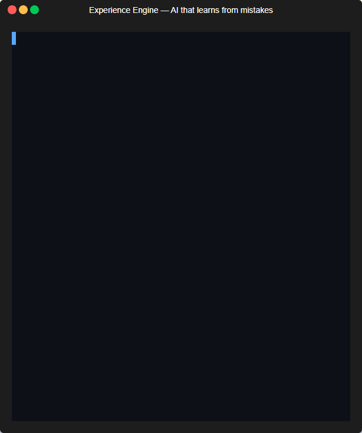

<h1 align="center">Experience Engine</h1>

<p align="center">
  <strong>Continual learning infrastructure for AI coding agents.</strong><br>
  Agents don't just remember facts — they learn from mistakes, generalize principles, and get better with every session.
</p>

<p align="center">
  
  
  
  
  
  
</p>

---

> Instead of accumulating facts linearly, knowledge evolves: incidents are captured, promoted to behavioral rules when confirmed, and generalized into principles that fire on novel cases never seen before. Memory shrinks as capability grows.

<p align="center">
  
</p>

## Quick Start

```bash
git clone https://github.com/muonroi/experience-engine.git
cd experience-engine
docker compose up -d
```

Starts Qdrant (6333), Ollama (11434), and Experience Engine API (8082). Zero API keys. Zero config files.

```bash
curl http://localhost:8082/health
# {"status":"ok","qdrant":{"status":"ok"},"fileStore":{"status":"ok"}}
```

Or use the interactive setup:

```bash
bash .experience/setup.sh
```

## Documentation

Full documentation at **[docs.muonroi.com/docs/experience-engine](https://docs.muonroi.com/docs/experience-engine/overview)**

| Topic | Link |
|---|---|
| Overview & architecture | [Overview](https://docs.muonroi.com/docs/experience-engine/overview) |
| Getting started | [Getting Started](https://docs.muonroi.com/docs/experience-engine/getting-started) |
| How it works | [How It Works](https://docs.muonroi.com/docs/experience-engine/how-it-works) |
| Configuration reference | [Configuration](https://docs.muonroi.com/docs/experience-engine/configuration) |
| REST API reference | [API Reference](https://docs.muonroi.com/docs/experience-engine/api-reference) |
| Observability & stats | [Observability](https://docs.muonroi.com/docs/experience-engine/observability) |
| Python SDK | [Python SDK](https://docs.muonroi.com/docs/experience-engine/python-sdk) |

## Requirements

- Node.js 20+
- One of: Docker · Qdrant Cloud (free tier) · VPS with Qdrant
- One of: Ollama (free, local) · API key for any supported provider

## License

MIT © [muonroi](https://github.com/muonroi)
