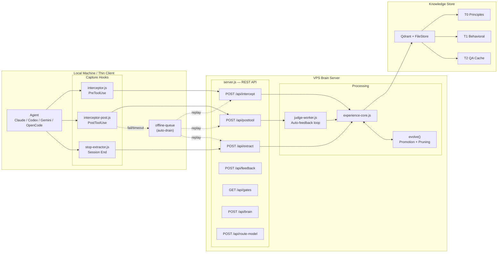

<p align="center">
  
</p>

<h1 align="center">Experience Engine</h1>

<p align="center">
  <strong>Continual learning infrastructure for AI coding agents.</strong><br>
  Agents don't just remember facts — they learn from mistakes, generalize principles, and get better with every session.
</p>

<p align="center">
  <a href="#demo">Demo</a> ·
  <a href="#the-problem">The Problem</a> ·
  <a href="#how-it-works">How It Works</a> ·
  <a href="#quick-start">Quick Start</a> ·
  <a href="#architecture">Architecture</a> ·
  <a href="#api">REST API</a> ·
  <a href="#comparison">Comparison</a>
</p>

<p align="center">
  
  
  
  
  
  
</p>

---

## Demo

<p align="center">
  
</p>

> An AI agent is about to register a singleton for a stateful EF Core context — the same mistake that caused a production bug two sessions ago. The experience engine intercepts the tool call, surfaces the T0 principle (generalized from 3 past incidents), and the agent writes the correct scoped registration instead. Zero developer intervention.

---

## The Problem

Every AI memory tool (Mem0, Letta, Zep, MemGPT) solves the same problem: *give the agent a bigger notebook.*

More sessions → more stored facts → more tokens → more cost. The agent never stops being a junior who needs to look up everything.

```
Without Experience Engine:
  Session 1:  DbContext singleton → production bug → 15 min debug
  Session 2:  DbContext singleton → same bug      → 15 min debug (again)
  Session 50: 200 memory entries.  Still making the same mistakes.

With Experience Engine:
  Session 1:  DbContext singleton → lesson extracted automatically
  Session 2:  About to repeat it  → hook fires → "⚠️ Last time: state corruption"
  Session 15: 3 similar lessons   → evolved into principle:
                                    "Stateful objects must be scoped, never singleton"
  Session 16: RedisConnection singleton (never seen before)
              → principle matches the novel case → bug avoided
              Memory: 50 entries → 15 principles. Fewer entries. More coverage.
```

**Core insight:** Knowledge should evolve from experience, not accumulate as facts. Memory that grows linearly is a liability — not an asset.

---

## How It Works

```
Agent writes code
  │
  ├─ BEFORE each mutating tool call
  │   ├─ Layer 1: Read-only skip (ls, cat, git log…) → bypassed instantly, $0
  │   ├─ Layer 2: Semantic search → "Have I seen this mistake before?"
  │   │           Ranks by: confidence · recency · hit frequency · domain match
  │   │           Follows 1-hop graph edges to surface related experiences
  │   └─ Layer 3: Brain relevance filter → LLM asks "is this warning relevant HERE?"
  │               ~200 tokens in, 1 token out. Fail-open if brain is slow.
  │               If relevant → injects: "⚠️ Last time this caused X [id:a1b2 col:behavioral]"
  │
  └─ AFTER each session
      ├─ Extracts lessons from mistakes (retry loops, corrections, test failures)
      ├─ Stores as Q&A in vector DB with domain/language/framework tags
      ├─ Judge worker: evaluates FOLLOWED / IGNORED / IRRELEVANT per hint
      └─ Evolution engine:
           3x confirmed → promote to Behavioral (T1)
           Cluster of T1 entries → generalize to Principle (T0)
           3x ignored or noise → demote + archive
           Memory SHRINKS as capability GROWS
```

### 4-Tier Knowledge Architecture

```
T0  Principles  (~400 tokens)   Generalized rules — always loaded, match novel cases
T1  Behavioral  (~600 tokens)   Specific confirmed reflexes — always loaded
T2  QA Cache    (semantic)      Detailed Q&A — retrieved on semantic match
T3  Raw         (staging)       Unprocessed lessons — TTL 30 days

Lifecycle:  T3 (extracted) → T2 → (3x confirmed) → T1 → (cluster) → T0
            T2 (3x ignored) → demote → archive
```

### Experience Graph

Experiences aren't isolated entries — they're linked with typed edges:

```
DbContext singleton ──generalizes──→ "Stateful objects: always scoped"
                    ──relates-to───→ HttpClient singleton
                    ──supersedes───→ [old] "Use transient for DbContext"
```

Retrieval follows 1-hop edges automatically — when one experience matches, related ones surface too.

### Temporal Reasoning

```
Jan:  "Use singleton for HttpClient"  (confirmed 5×)
Mar:  "Actually, use IHttpClientFactory"  → contradicts Jan entry
      → Jan entry superseded, not deleted
      → New entry ranked higher (recent confirmation)
      → /api/timeline shows the full evolution
```

---

## Runtime Architecture


```mermaid
flowchart LR

subgraph CLIENT["Local Machine / Thin Client"]
    AGENT["Agent\nClaude / Codex / Gemini / OpenCode"]

    subgraph HOOKS["Capture Hooks"]
        PRE["interceptor.js\nPreToolUse"]
        POST["interceptor-post.js\nPostToolUse"]
        STOP["stop-extractor.js\nSession End"]
    end

    QUEUE["offline-queue\n(auto-drain)"]
end

subgraph SERVER["VPS Brain Server"]
    subgraph API["server.js — REST API"]
        I1["POST /api/intercept"]
        I2["POST /api/posttool"]
        I4["POST /api/extract"]
        I5["POST /api/feedback"]
        I6["GET  /api/gates"]
        I7["POST /api/brain"]
        I8["POST /api/route-model"]
    end

    subgraph CORE["Processing"]
        CORE2["experience-core.js"]
        JUDGE["judge-worker.js\nAuto-feedback loop"]
        EVO["evolve()\nPromotion + Pruning"]
    end
end

subgraph MEMORY["Knowledge Store"]
    STORE["Qdrant + FileStore"]
    T0["T0 Principles"]
    T1["T1 Behavioral"]
    T2["T2 QA Cache"]
end

AGENT --> PRE --> I1 --> CORE2
AGENT --> POST --> I2 --> JUDGE --> CORE2
AGENT --> STOP --> I4 --> CORE2
CORE2 --> STORE --> T0 & T1 & T2
CORE2 <--> EVO
POST -. "fail/timeout" .-> QUEUE -. "replay" .-> I1 & I2 & I4
```

---

## Quick Start

### Docker (recommended)

```bash
git clone https://github.com/muonroi/experience-engine.git
cd experience-engine
docker compose up -d
```

Starts: Qdrant (6333) · Ollama with models auto-pulled (11434) · Experience Engine API (8082).

```bash
curl http://localhost:8082/health
# {"status":"ok","qdrant":{"status":"ok"},"fileStore":{"status":"ok"}}
```

100% local. Zero API keys. Zero config files.

### Interactive Setup

```bash
bash .experience/setup.sh
```

```
Step A — Vector store:    Qdrant Cloud / Local Docker / VPS SSH tunnel
Step B — Embed provider:  OpenAI / Gemini / SiliconFlow / VoyageAI / Ollama / Custom
Step C — Brain provider:  OpenAI / Gemini / Claude / DeepSeek / SiliconFlow / Ollama / Custom
Step D — Agent wiring:    Claude Code / Gemini CLI / Codex CLI / OpenCode
```

### npm

```bash
npx @muonroi/experience-engine setup

# Thin client (connect to a shared VPS brain)
npx @muonroi/experience-engine setup-thin-client \
  --server http://your-vps:8082 \
  --token YOUR_TOKEN
```

---

## Thin Client / VPS Architecture

One canonical brain on a VPS. Any number of developer machines as thin clients.

```json
{
  "serverBaseUrl": "http://your-vps:8082",
  "serverAuthToken": "your-token"
}
```

- **VPS holds:** Qdrant, embed/brain API keys, extract/evolve jobs, all knowledge state
- **Each dev machine holds:** hooks, config, local queue only
- **Offline:** events queue locally, drain automatically when VPS is reachable again
- **New workstation:** one command → instantly shares the team's accumulated knowledge

---

## REST API

```bash
node server.js
# Experience Engine API running on http://localhost:8082
```

| Method | Path | Description |
|--------|------|-------------|
| `GET`  | `/health` | Liveness check — Qdrant + FileStore status |
| `POST` | `/api/intercept` | Query experience before a tool call |
| `POST` | `/api/posttool` | Post-tool outcome + judge enqueue |
| `POST` | `/api/extract` | Extract lessons from session transcript |
| `POST` | `/api/evolve` | Trigger promotion / pruning cycle |
| `GET`  | `/api/stats` | Observability: hit rate, mistakes avoided, velocity |
| `GET`  | `/api/gates` | Server-side readiness report |
| `GET`  | `/api/graph` | Graph edges for an experience ID |
| `GET`  | `/api/timeline` | Knowledge evolution for a topic |
| `POST` | `/api/feedback` | Report FOLLOWED / IGNORED / IRRELEVANT verdict |
| `POST` | `/api/route-model` | Route task to optimal model tier |
| `POST` | `/api/route-task` | Route task to optimal workflow |
| `POST` | `/api/brain` | Proxy LLM call through server (firewall support) |
| `POST` | `/api/principles/share` | Export principle as portable JSON |
| `POST` | `/api/principles/import` | Import shared principle |

Zero dependencies — Node.js built-in `http`. CORS enabled.

### Example: Intercept

```bash
curl -X POST http://localhost:8082/api/intercept \
  -H "Content-Type: application/json" \
  -d '{"toolName": "Write", "toolInput": {"file_path": "src/db.ts"}}'
```

```json
{
  "suggestions": "⚠️ [Experience - High Confidence (0.85)]: Stateful objects must be scoped, never singleton\n   Why: Last time this caused state corruption in production\n   [id:a1b2c3d4 col:experience-behavioral]",
  "hasSuggestions": true
}
```

### Example: Model Router

```bash
curl -X POST http://localhost:8082/api/route-model \
  -H "Content-Type: application/json" \
  -d '{"task": "debug race condition in auth", "runtime": "codex"}'
```

```json
{
  "tier": "premium",
  "model": "gpt-5.4",
  "reasoningEffort": "high",
  "confidence": 0.85,
  "source": "brain"
}
```

Three layers, fastest first: **Keywords** (~0ms) → **History** (~50ms) → **Brain LLM** (~200ms).

---

## Python SDK

```bash
pip install muonroi-experience
```

```python
from muonroi_experience import Client

client = Client("http://localhost:8082")

# Query before a tool call
result = client.intercept("Write", {"file_path": "app.py"})
if result["hasSuggestions"]:
    print(result["suggestions"])

# Extract lessons from a session transcript
client.extract("Agent tried singleton for DbContext, caused state corruption...")

# Trigger evolution
evolution = client.evolve()
print(f"Promoted: {evolution['promoted']}, Abstracted: {evolution['abstracted']}")

# View knowledge evolution over time
timeline = client.timeline("dependency injection")
for entry in timeline["timeline"]:
    print(f"  {'[superseded]' if entry['superseded'] else ''} {entry['solution']}")
```

Zero dependencies — Python stdlib `urllib`. Python 3.8+.

---

## Comparison

| | Mem0 | Letta | Zep | **Experience Engine** |
|---|---|---|---|---|
| **Storage model** | Facts accumulate | Agent self-edit | KG + facts | **Extract → Evolve → Generalize** |
| **Memory over time** | Grows linearly | Grows linearly | Grows linearly | **Shrinks (principles replace entries)** |
| **Novel case coverage** | Exact match only | Exact match only | Exact match only | **Principles generalize to unseen cases** |
| **Mistake detection** | No | No | No | **Yes — 5 pattern types** |
| **Automatic feedback loop** | No | No | No | **Yes — judge-worker, no agent cooperation needed** |
| **Local-first** | Optional | Optional | Partial | **Yes — FileStore default, zero cloud required** |
| **Runtime dependencies** | Python + SDK | PostgreSQL + pgvector | PostgreSQL | **Zero — Node.js built-in** |
| **Multi-agent** | Yes | Yes | Limited | **Claude / Gemini / Codex / OpenCode** |
| **Data ownership** | Vendor cloud | SaaS | Vendor cloud | **You own everything** |
| **Token cost trend** | ↑ grows | ↑ grows | ↑ grows | **↓ shrinks** |

---

## Anti-Noise: 3-Layer Filter

Noise kills value. The engine uses three layers:

**Layer 1 — Read-only skip (regex, 0ms, $0)**
Commands that never mutate code bypass entirely: `ls`, `cat`, `git log`, `docker ps`, etc. Chained commands skip only if ALL parts are read-only.

**Layer 2 — Quality scoring**
- Hit frequency, recency, confidence aging
- Language/framework gate (`.ts` → TypeScript only; `.cs` → C# / dotnet only)
- Domain match, temporal decay, superseded penalty
- Session dedup (same warning never shown twice per session), budget (max 8 per session)
- Noise suppression for repeated `wrong_repo` / `wrong_language` / `wrong_task` / `stale_rule`

**Layer 3 — Brain relevance filter (LLM, ~1 output token, fail-open)**

```
Input:  ACTION: Edit Startup.cs — services.AddSingleton<DbContext>()
        1. Stateful objects must be scoped, never singleton
        2. Always use IMLog, never ILogger
        3. Never modify ePort consumer code

Output: 1        (only warning #1 is relevant to this specific action)
```

Cost: ~200 input tokens + 1 output token. $0 with Ollama, ~$0.00004 with SiliconFlow. Fail-open if brain is slow (>3s).

---

## Judge Worker — Closed Feedback Loop

After each tool call, a detached background process evaluates whether the agent followed the hint — **without any agent cooperation**.

```
interceptor-post.js  →  judge-worker.js  →  brain LLM
                                          →  FOLLOWED   (positive signal)
                                          →  IGNORED    (negative signal)
                                          →  IRRELEVANT (noise tag + reason)
                                          →  UNCLEAR    (abstain)
```

This closes the feedback loop automatically. Manual `exp-feedback` still accepted for stronger signals.

---

## Supported Providers

| Embedding | Brain |
|-----------|-------|
| Ollama (nomic-embed-text) | Ollama (qwen2.5:3b) |
| OpenAI (text-embedding-3-small) | OpenAI (gpt-4o-mini) |
| Gemini (text-embedding-004) | Gemini (gemini-2.0-flash) |
| VoyageAI (voyage-code-3) | Claude (haiku) |
| SiliconFlow (Qwen3-Embedding) | DeepSeek (deepseek-chat) |
| Custom (any OpenAI-compatible) | SiliconFlow (Qwen2.5-7B) |
| | Custom (any OpenAI-compatible) |

---

## Observability

```bash
node tools/exp-stats.js              # last 7 days
node tools/exp-stats.js --since 30d  # custom window
node tools/exp-stats.js --all        # all time

bash ~/.experience/health-check.sh        # 14-point diagnostic dashboard
bash ~/.experience/health-check.sh --json # machine-readable output
bash ~/.experience/health-check.sh --watch # auto-refresh every 30s
exp-health-last                           # last persisted snapshot
```

Health check covers: Config · SSH tunnel · Qdrant · Embed API · Brain API · Core files · Agent hook wiring · Activity log · Model routing.

---

## Bootstrap Your Brain Instantly

Don't wait months for organic learning. Seed from existing rules:

```bash
node tools/experience-bulk-seed.js --memory-dir ~/.claude/projects/*/memory
```

---

## Agent Hook Compatibility

| Agent | Windows | macOS/Linux | WSL |
|-------|---------|-------------|-----|
| Claude Code | Works | Works | — |
| Gemini CLI | Works | Works | — |
| Codex CLI | **Hooks disabled** | Works | **Works** |
| OpenCode | Works | Works | — |

> **Codex on Windows:** Run from WSL. `setup.sh` handles all WSL-specific wiring automatically.

---

## File Structure

```
.experience/
  experience-core.js      Engine core (zero deps)
  interceptor.js          PreToolUse hook
  interceptor-post.js     PostToolUse hook
  interceptor-prompt.js   UserPromptSubmit hook
  stop-extractor.js       Session-end extraction + evolution trigger
  judge-worker.js         Async LLM judge — auto-feedback loop
  remote-client.js        Thin-client HTTP transport + offline queue
  setup.sh                Guided setup wizard
  setup-thin-client.sh    Thin-client installer
  health-check.sh         Diagnostic dashboard

server.js                 REST API (zero deps)

sdk/
  python/                 Python SDK (pip install muonroi-experience)

tools/
  exp-stats.js            Observability CLI
  exp-portable-backup.js  VPS brain export
  exp-portable-restore.js VPS brain import
  experience-bulk-seed.js Bootstrap from existing rules
  exp-server-maintain.js  Scheduled maintenance (cron)
```

---

## Philosophy

> **"Enterprise AI replaces you. Personal AI empowers you. Same technology. Different owner."**

- Your data never leaves your machine unless you choose cloud sync
- Zero vendor lock-in — standard formats, portable profiles
- Engine is open source — you pay for convenience, not capability
- Profiles belong to individuals, not companies

---

## Requirements

- Node.js 20+
- One of: Docker · Qdrant Cloud (free tier) · VPS with Qdrant
- One of: Ollama (free, local) · API key for any supported provider

## License

MIT © [muonroi](https://github.com/muonroi)
